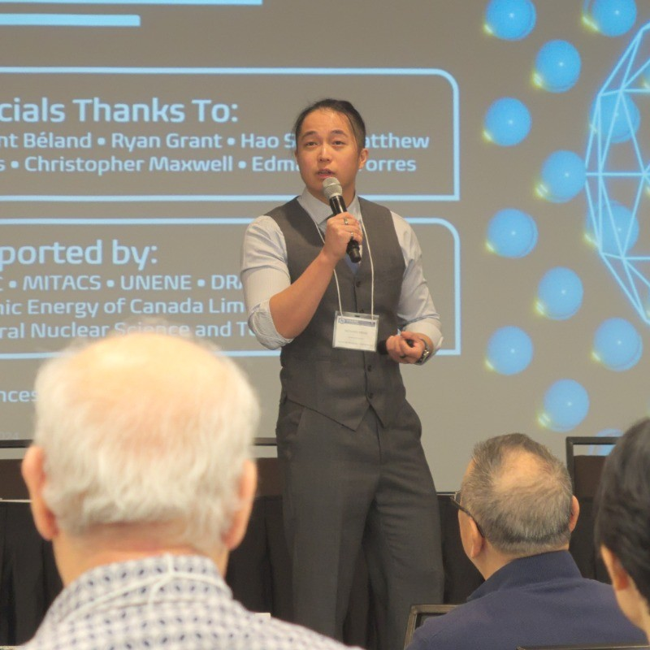
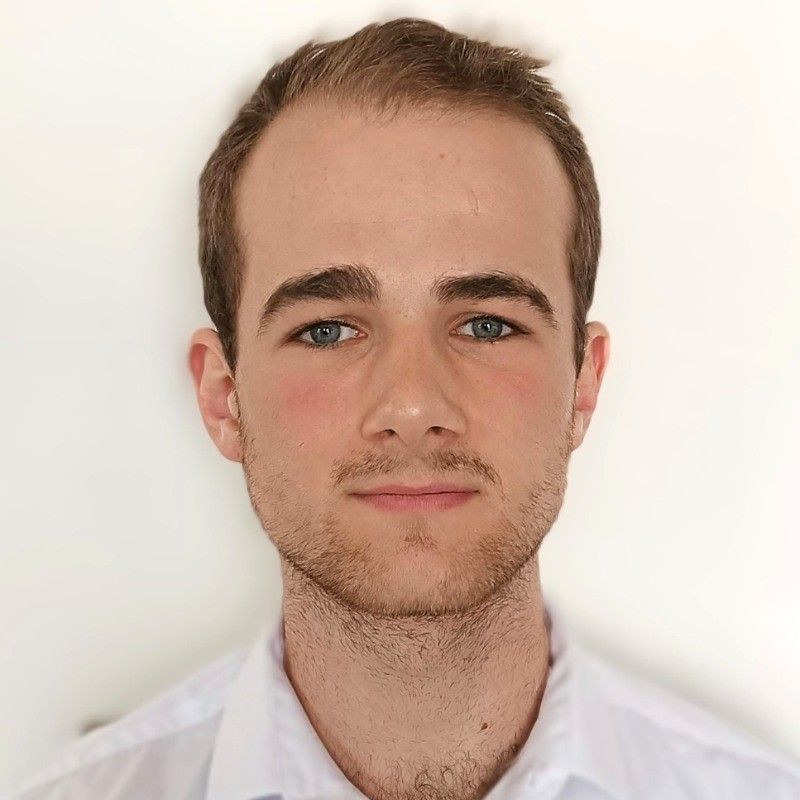
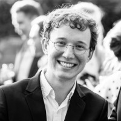
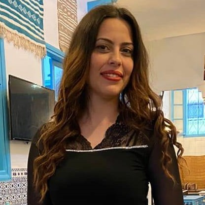

## PI: Thomas D Swinburne
 
Assistant Professor, Mechanical Engineering, <a href="https://me.engin.umich.edu/people/faculty/thomas-swinburne/" target="_new">University of Michigan</a> 
External researcher, <a href="https://www.inp.cnrs.fr/fr" target="_new">CNRS Physique</a> 
Associate Editor, <a href="https://www.sciencedirect.com/journal/computational-materials-science/about/editorial-board" target="_new">Computational Materials Science</a>
 <a href="pdf/CV-TomSwinburne-2025.pdf" target="_new">CV</a>
&nbsp;/&nbsp;
<a href="https://scholar.google.com/citations?hl=en&user=vgHQd9cAAAAJ&view_op=list_works&sortby=pubdate" target="_new">Google Scholar</a>
&nbsp;/&nbsp;
<a href="https://github.com/tomswinburne/" target="_new">GitHub</a>
 
 
## Current Members 
 
<a href="https://scholar.google.com/citations?user=w3LWShwAAAAJ&hl=en" target="_new"><strong>Marvin Poul</strong></a> 
2026-: Research Fellow, Differentiable phase diagrams 
University of Michigan 

 
<a href="https://www.richardzjm.com" target="_new"><strong>Richard Meng</strong></a> 
2026-: Incoming PhD & MICDE Fellow, Machine learning potentials 
University of Michigan, with Prof V Gavani 

 
<strong>Jack Jiang</strong>
2026: MSc, Uncertainty quantification for ODEs 
University of Michigan 

 
<strong>George Simmonds</strong> 
2025-: PhD, Bayesian inverse problems in atomic simulation 
University of Warwick, with Prof J Kermode and Prof T Hudson 

 
<strong>Guillaume Commelin</strong> 
2025-: PhD, analysis and forecasting of dislocation plasticity (ANR DAPREDIS)  
Sorbonne Paris Nord, with Prof S Queyreau 

 
<a href="https://fr.linkedin.com/in/l%C3%A9onard-moracchini-04b833175/en" target="_new"><strong>Léonard Morachini</strong></a> 
2025-: PhD, UQ for atomic simulations of rare events 
IFPEN, Paris, with Drs T Pidgeon, M Menz & MC Marinica 

 
<strong>Emna Frikha</strong> 
2024-: PhD, predicting He retention in plasma-facing W (ANR HEBERTUNE) 
Sorbonne Paris Nord, with Prof J Mougenot.

## Past Members
<strong>Ivan Maliyov</strong> 
Postdoc, automatic differentiation in materials science 
Now: <strong>Research Scientist, Microsoft Quantum</strong>

<strong>Raynol Dsouza</strong> 
PhD + SALTO scholar, with Prof J Neugebauer (MPIE) 
Now: <strong>Postdoc, IRSN Caderache</strong>

<strong>Petr Grigorev</strong> 
Postdoc, Machine learning assisted DFT methods 
Now: <strong>Permanent CNRS Researcher, Lyon</strong>

<strong>Clovis Lapointe</strong>  
PhD, ML for defect entropics (with Dr MC Marinica, CEA) 
Now: <strong>Staff scientist, CEA Saclay</strong>

<strong>Deepti Kannan</strong>  
MSc, reducing Markov Chains (with Prof DJ Wales, Cam.) 
Now: <strong>PhD candidate, MIT</strong>

## Frequent Collaborators
- Dr. Mihai-Cosmin Marinica, SRMP, CEA Saclay, FR
- Dr. Danny Perez, XCP-AI, Los Alamos, USA
- Prof. David Wales FRS, Univ. Cambridge, UK
- Prof. Dr. Jörg Neugebauer, Max Planck SusMat, DE
- Prof. James Kermode, Univ. Warwick, UK
- Prof. Sylvain Queyreau, Sorbonne Paris Nord, FR
